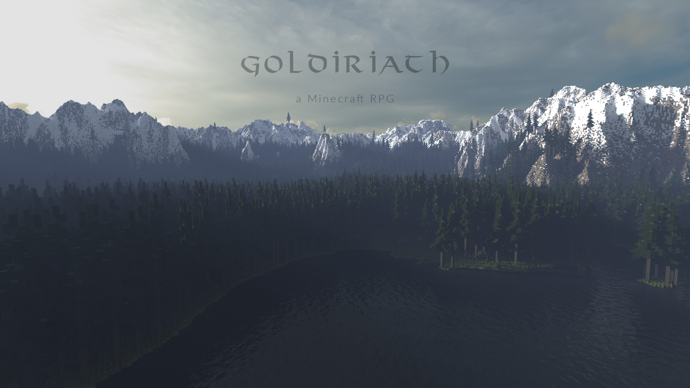

# Goldiriath

Goldiriath is a Minecraft-based RPG plugin for Spigot servers. Goldiriath was created to push the boundaries of non-modded Minecraft, creating a unique experience for RPG fans and Minecrafters alike.

For more information about the Goldiriath project, its members and implementation details, please [visit the wiki](https://github.com/Goldiriath/Goldiriath/wiki).

### Compiling
You will need [Aero](https://github.com/Pravian/Aero), a commons library for Bukkit/Spigot plugins.

Compiling is a simple as running maven build.

### Contributing
Contributions are always welcome. Be prepared however: our needs are very specific and therefore there's a chance your contribution does not align well with Goldiriath's goals.
